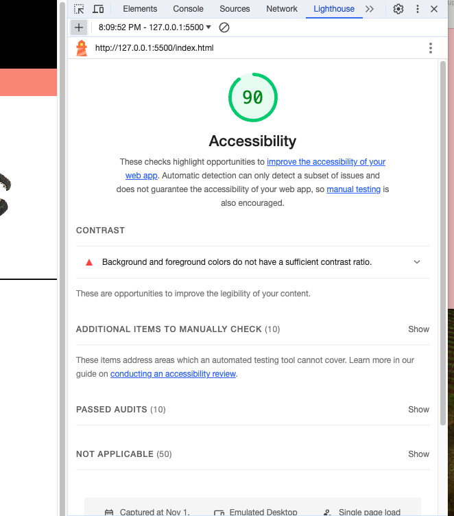

# LAB - 08a Cookie Stand

## Pat's Salmon Cookies

Continuing to build the website for Pat's Salmon Cookies

### Author: Johnny Backus

### Links and Resources

* ChatGPT was used frequently (though it certainly let me astray a couple times)

### Lighthouse Accessibility Report Score

### Reflections and Comments
With this assignment I was often thwarted by misapplying my tools as often as I was stumped by code. For example, using the link in my live preview took me back to the page that was being deployed from my main branch on GitHub. It took me way longer than it should have to figure out that this is why I wasn't seeing my changes or has unexpected errors. Unfortunatley, this happened twice before I realized how I was tripping myself up. It also took me a while to figure that I needed two JS files since each page quits rendering when the JS code gets to an element ID that is not on that page. Once again, learning the error codes and how to best use the Chrome developer tools is going to help a lot.
