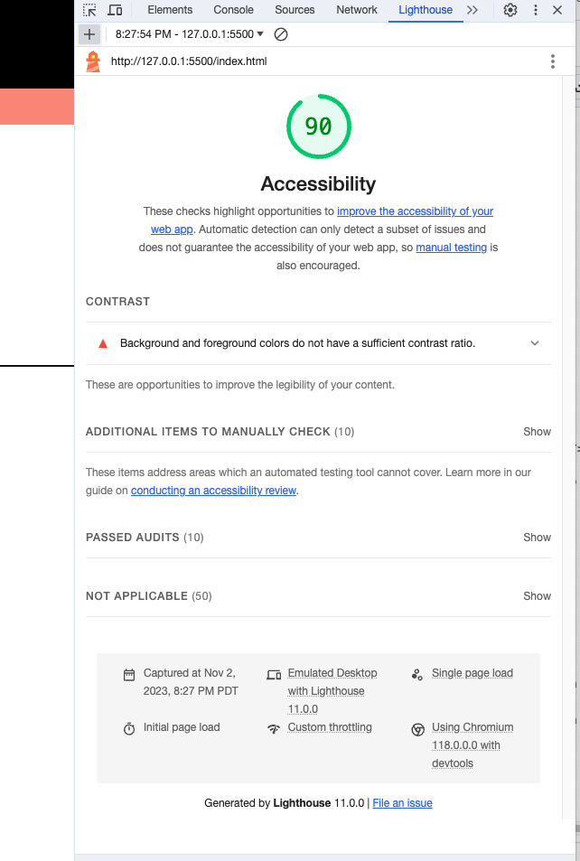

# LAB - 09 Cookie Stand

## Pat's Salmon Cookies

Continuing to build the website for Pat's Salmon Cookies: Today we build a form!

### Author: Johnny Backus

### Links and Resources

* ChatGPT was used frequently (though it certainly let me astray a couple times)

### Lighthouse Accessibility Report Score

### Reflections and Comments
It's hard to keep track of what's calling who from where. I see how it's efficient, but it's gonna take some getting used to. On the bright side, my code is fairly clean. This lab took me about seven hours... a bit longer than I had hoped. Creating the form wasn't too hard, but figuring out how to store and then access the information was super confusing. I think precise understanding of different definitions will help in the future.
