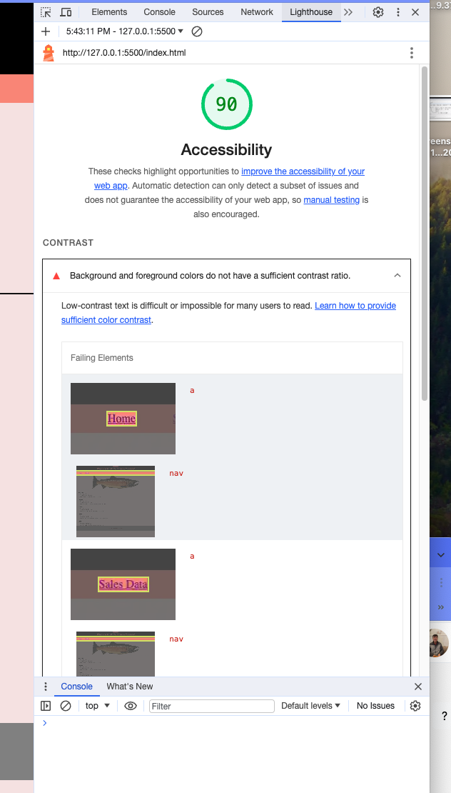

# LAB - 10b Cookie Stand

## Pat's Salmon Cookies

Putting in some finishing touches!

### Author: Johnny Backus

### Links and Resources

* ChatGPT was used frequently throughout this project (though it certainly let me astray a couple times).

### Lighthouse Accessibility Report Score

### Reflections and Comments
We were limited to one hour today, so I made some minor style buffs and added made populating the table header row part of my renderTable function and removed the hardcoding from the HTML. I'm pretty happy with how many lines of code I was able to lop off over the course of the week. This took me as long as I expected since we were limited to one hour. Definitely for the best, because I would have spent too long continuing to try to figure out how to turn the links in my header black.
